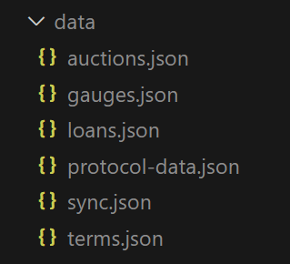

# ECG-Node

Open-source node for Ethereum Credit Guild off-chain tooling (calls, liquidations, offboarding...) 

# Run it

## Install nodejs

All development is done using:
- nodejs v20.9.0
- npm v10.1.0

Refer to NodeJS website for installation guidelines: https://nodejs.org/en

or use nvm: https://github.com/nvm-sh/nvm

## Clone

`git clone https://github.com/volt-protocol/ecg-node.git`

## Install dependencies

`npm install`

## Generating Contract Types

Before building the project, you need to generate TypeScript typings for your smart contracts. This ensures that TypeScript can recognize and type-check the contract interactions within your code.

`npm run typechain`

## Build

`npm run build`

All files needed will be in the `./build` directory

## Run

This a very basic example about how to start the ECG-Node in your shell. 
This assume your on an Unix platform.

### Install dependencies in the build folder

`cd ./build && npm install`

### Start the script

You need to have some env variables set before launching the script. You can set them either with

`export XXX=YYY` or by starting the script with the variables directly.

`APP_NAME=ECG_NODE_BASIC_TEST NETWORK=SEPOLIA RPC_URL=https://sepolia.infura.io/v3/XXXXX RPC_URL_LISTENER=https://sepolia.infura.io/v3/XXXXX MARKET_ID=42 node ECGNode.js`

You need to set your correct infura key in the example above

### Basic start logs

#### Data fetcher

Running the ECG-Node without any processors will still start the data fetcher and the event listener.

You should see these logs:

```
[ECG_NODE] | MARKET 42 | [ECG-NODE] STARTED FOR MARKET_ID: 42
[ECG_NODE] | MARKET 42 | FetchECGData: fetching data up to block 6332160
[ECG_NODE] | MARKET 42 | FetchECGData: start fetching
[ECG_NODE] | MARKET 42 | GetFullConfigFile: loading protocol data from https://raw.githubusercontent.com/volt-protocol/ecg-node/main/params/protocol-config.SEPOLIA.json
[ECG_NODE] | MARKET 42 | FetchECGData: protocol data took: 1125.8 ms
[ECG_NODE] | MARKET 42 | FetchECGData[Terms]: starting
[ECG_NODE] | MARKET 42 | Using multicall length: 480000
[ECG_NODE] | MARKET 42 | FetchECGData[Terms]: sending 50 multicall
[ECG_NODE] | MARKET 42 | FetchECGData[Terms]: end multicall
[ECG_NODE] | MARKET 42 | GetAllTokensFromConfiguration: loading tokens data from https://raw.githubusercontent.com/volt-protocol/ecg-node/main/params/tokens.SEPOLIA.json
[ECG_NODE] | MARKET 42 | FetchECGData: terms data took: 2326.3 ms
[ECG_NODE] | MARKET 42 | FetchECGData[Loans]: starting
[ECG_NODE] | MARKET 42 | FetchECGData[Loans]: fetchNewLoanOpen starting
[ECG_NODE] | MARKET 42 | FetchECGData[Loans]: fetchNewLoanOpen ending
[ECG_NODE] | MARKET 42 | FetchECGData[Loans]: sending loans() multicall for 4 loans
[ECG_NODE] | MARKET 42 | FetchECGData[Loans]: end multicall
[ECG_NODE] | MARKET 42 | FetchECGData[Loans]: fetchClosedEventsAndUpdateLoans starting
[ECG_NODE] | MARKET 42 | FetchECGData[Loans]: fetchClosedEventsAndUpdateLoans ending
[ECG_NODE] | MARKET 42 | FetchECGData[Loans]: ending
[ECG_NODE] | MARKET 42 | FetchECGData: loan data took: 887.1 ms
[ECG_NODE] | MARKET 42 | FetchECGData[Gauges]: starting
[ECG_NODE] | MARKET 42 | FetchECGData[Gauges]: Updated 3 gauges
[ECG_NODE] | MARKET 42 | FetchECGData: gauges data took: 1060.1 ms
[ECG_NODE] | MARKET 42 | FetchECGData[Auctions]: starting
[ECG_NODE] | MARKET 42 | FetchECGData[Auctions]: sending getAuction() multicall for 0 loans
[ECG_NODE] | MARKET 42 | FetchECGData[Auctions]: end multicall
[ECG_NODE] | MARKET 42 | FetchECGData[Auctions]: ending
[ECG_NODE] | MARKET 42 | FetchECGData: auctions data took: 1224.7 ms
[ECG_NODE] | MARKET 42 | FetchECGData[AuctionHouse]: starting
[ECG_NODE] | MARKET 42 | FetchECGData[AuctionHouse]: ending
[ECG_NODE] | MARKET 42 | FetchECGData: auction house data took: 31.3 ms
[ECG_NODE] | MARKET 42 | FetchECGData[Proposals]: starting
[ECG_NODE] | MARKET 42 | FetchECGData[Proposals]: ending
[ECG_NODE] | MARKET 42 | FetchECGData: fetchProposals data took: 994.1 ms
[ECG_NODE] | MARKET 42 | FetchECGData: finished fetching. Fetch duration: 8482.1 ms
```

And you should see the `./data/market_42` dir (full path should be `./build/data/market_42`):



These files store the most up-to-date data about the protocol. See [ECG Data Fetcher](./docs/datafetcher/ecg-data-fetcher.md) for more details

#### Listeners
At the end of the logs, you should see the listener being started:

```
[ECG_NODE] | MARKET 42 | Starting universal event listener
[ECG_NODE] | MARKET 42 | Started the event processor
[ECG_NODE] | MARKET 42 | Starting terms listener for 3/8 terms
```

These are event listeners that will check protocol changes that require updating the protocol data. Events like: LoanOpen, LoanClose, AddGauge (new lending term), etc...

When computing an event, it will trigger a new data fetch ==> ensuring all *.json files are the most up-to-date at all times.
