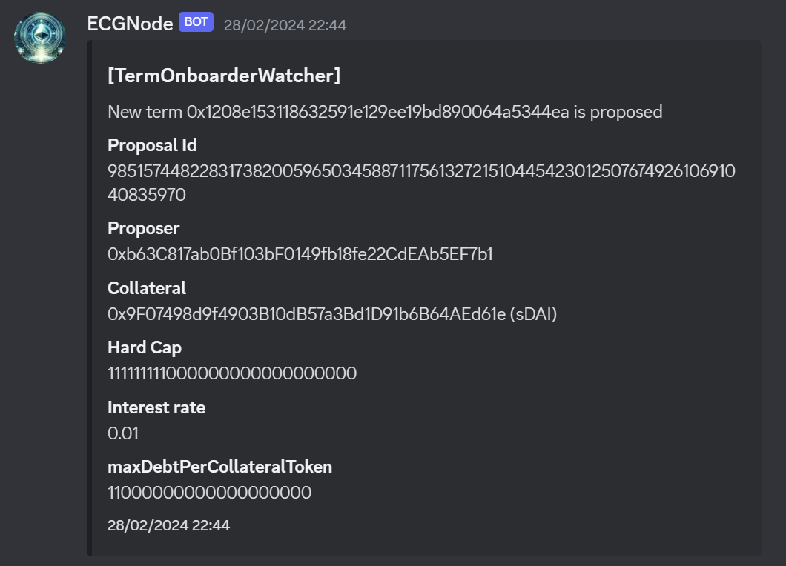
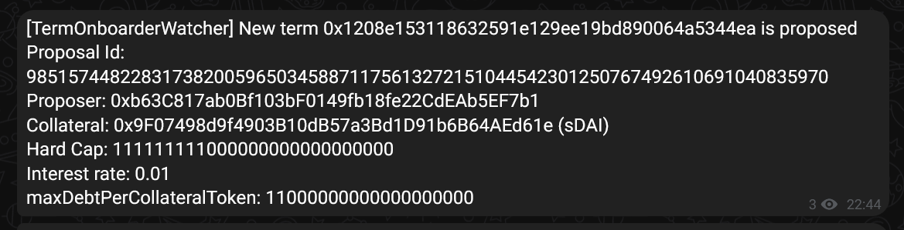

# Term Onboarding Watcher

This processor is just a notifier for when a new lending term is proposed.

This processor is creating a listener on the onboarding contract and it waits for a 'ProposalCreated' event to be emitted.

It can outputs to either discord or telegram or both

Example discord notification:

Example telegram notification:

## Requirements

You need to have at least one notification channel activated using environment variables

For telegram:
- WATCHER_TG_BOT_ID
- WATCHER_TG_CHAT_ID

See telegram documentation to generate it: https://core.telegram.org/

For discord:
- WATCHER_DISCORD_WEBHOOK_URL

See discord documentation to generate it: https://support.discord.com/hc/en-us/articles/228383668-Intro-to-Webhooks

## Parameters

None (except the enabled)